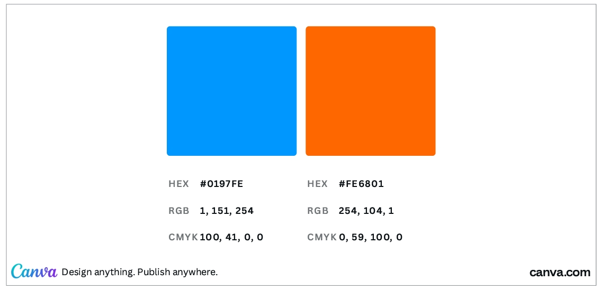
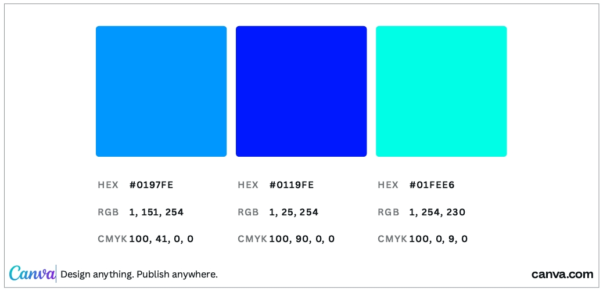
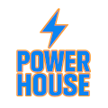
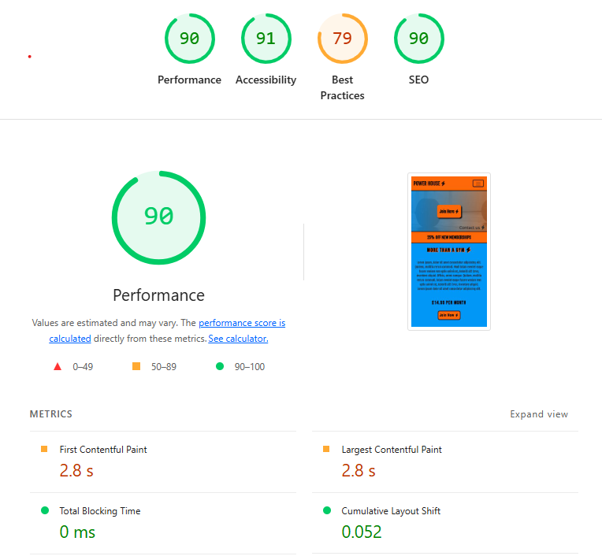

## POWER HOUSE 
### By Gary Hird 
### 3rd of July 2025 (MileStone Project 1)

---

## Introduction 
I have chosen to make my first 'milestone' project a health and fitness website for a gymnasium establishment. 
As somebody who regularly attends a gym, i hope this passion and natural interest will help better the level of content i am able to produce for this website. 

This is my first comprehensive 'Readme' document using the markdown language. 
i will attempt to add as much detail prior to the project and update as the project progresses. 

---

## Design 

I want my site to be fun and stylish with bright colors and promote the gym to more potential members 
with pages for Membership, Facilities and a Contact page. 

For the Navigation i will use a  'Sticky Navbar' that maintain visible on screen, so users can visit other areas of the site easily. 
I will be using lots of Bootstrap for positioning content across the site.

i like information to be tidy and in collapsed form so it is not displayed when not wanted so will use the bootstrap collapse/collapsed function to hide and display. 

I have made my own photo carousel before using basic JavaScript and will recreate that for the Facilities page, where you just click on the image to bring up the next image in its place.
I prefer this carousel rather than ones available with Bootstrap 5 

i will be using Lorem Ipsum in areas to fill text space and a variety of google fonts and diffrent size headings from H1 to H4

On the contact page i will give some drop down Frequently Asked Questions which will hopefully answer any questions users have prior to making contact with staff to prevent excessive messages. 

Form labels and image alts will be acuate to make the site more accessible 

## Colors 

My favorite color is 'Electric Blue' and thought it would look good for a Gym Website.
using my knowledge learnt doing a Level 2 Graphics Design collage course i found a website 'Canva.com'
which had a online Color Wheel and found a hash code for a blue color that i liked  #0197FE

Using the Color Wheel i found that the complimentary color for that specific blue was an orange   #FE6801
'Complimentary colors are colors that work well together (complement each other) the are found directly opposite each other on color wheels

Going further i looked into the analogous colors which also work well 

Colors used:
 #FE6801  (Orange)
 #0197fe  (Light Blue)
 #f8f9fa  (Off white)
 #0119FE  (Dark Blue)

## Logo 
            
Firstly i used Chat GPT to create a logo, that i was going to use in the center of the hero section
but i decided against using the logo and also wanted to put a model button in that prime position. 

I decided it was better to use a logo created myself using CSS than a logo created by AI. 

## Images 

All images used from www.pexels.com
Below are the credited photographers

All Pages:

Navigation image of weights bar: Photographer Tima Miroshnichenko

Home Page

Fitness Class photo: Photographer Andrea Piacquadio
Fitness instructor Image: Photographer Andres Ayrton
Fitness test: Photographer Nataliya Vaitkevich
Coach Image: Photographer Safi Erneste

Other activities 
Rock climbing: Photographer Allan Mas
Hillside walk: Photographer Nataliya Vaitkevich
Lincoln 10k: Photographer RUN 4 FFWPU

Facilities Page / Photo Library 

Outside Gym:  Photographer Andrea Piacquadio
Indoor swimming pool: Photographer SHVETS production
Fitness Class: Photographer Andrea Piacquadio
Sports Hall: Photographer Pavel Danilyuk
Gym photos: Photographer Tima Miroshnichenko
Treadmill Photo: Photographer William Choquette

## Testing

Home / Index Page

- Warning: This document appears to be Lorem ipsum text but the html start tag has lang="en". Consider using lang="zxx" (or variant) instead. 
    Not addressing this warning as lorem ipsum text is just used as temporary design filler

- Error (Bad value button for attribute type on element a:) 
Caused by converting a model open button to a 'a href link' 
    Solved by removing the type attribute, including editing Membership, Facilities and Contact Page 
- Error caused by having form opening and closing tags in different divs. 
    placed form inside same div and on all other pages. 
- Warning Empty heading, i used a h4 tag for just a font awesome down arrow. 
    Removed h4 tags and customized then i separately on this page and all others
- Warning The document is not mappable to XML 1.0 due to two consecutive hyphens in a comment.
    Removed extra hyphen from a Comment for the discount section on all pages. 
- Warning Consider using the h1 element as a top-level heading only from discont section 'More than a gym'
    Changed this H1 heading to a H2 on all pages

--- 
Membership Page

- Error Stray end tag div line 420
    removed extra closing tag 

- Warning The document is not mappable to XML 1.0 due to two consecutive hyphens in a comment.
    removed additional hyphen from the comment above the 'League table comment on line 179 
---
Facilities Page

- Warning: This document appears to be Lorem ipsum text but the html start tag has lang="en". Consider using lang="zxx" (or variant) instead. 
    Not addressing this warning as lorem ipsum text is just used as temporary design block text  filler

- Warning: The document is not mappable to XML 1.0 due to two consecutive hyphens in a comment.
    removed additional hyphen from the comment above the 'facilities comment on line 162 

---
Contact Page

- Warning: This document appears to be Lorem ipsum text but the html start tag has lang="en". Consider using lang="zxx" (or variant) instead. 
    Not addressing this warning as lorem ipsum text is just used as temporary design block text filler

- Warning Empty heading (5 times)
    The font awesome in h4 tags line 188, 206, 224, 242 and 260.
    Removed all 5 h4 'open and closing' tags No CSS change necessary as display wasn't grossly effected 

- Error: Stray end tag div.
    removed stray closing div line 272

- Error: Bad value 'Email Address' for attribute for on element label: An ID must not contain whitespace.
    Removed white space on all of the forms 'for' attributes on labels and gave all inputs a id matching

CSS Style sheet 

- 434 .photo-library .bottom-nav p	
Value Error : text-shadow Too many values or values are not recognized : #0197fe

- 483.FAQ .faq-box i	
Value Error : text-shadow Too many values or values are not recognized : #0119FE

## Lighthouse

Completed Lighthouse Assessment

Performance 90
Accessability 91
Best Practices 79
SEO 90 

## Bugs

Large Images were causing slow page loading.
I solved this issue using GIMP to scale and resize images to 552px width By 308px height.

## Used Recourses  

- Bootstrap version 5.2.3 
- Font Awesome 
- Google Fonts 
- Gimp image editing 
- Font-family: Bebas Neue
- Font family: Fjalla One

## Additional Recourses 

- Canva.com 'Colour circle'
- W3Schools website
- W3C validator.w3.org 
- W3C CSS Valdation
- Pexels
- Chat GPT (for logo but not used)

### Books
- HTML & CSS by John Duckett
- JavaScript & JQuery by John Duckett
- CSS Mastery by Andy Budd
- CSS Secrets by Lea Verou 
- Bootstrap Reference Guide by Jacob Lett 
- Mastering Bootstrap 5 by Frahaan Hussain 

